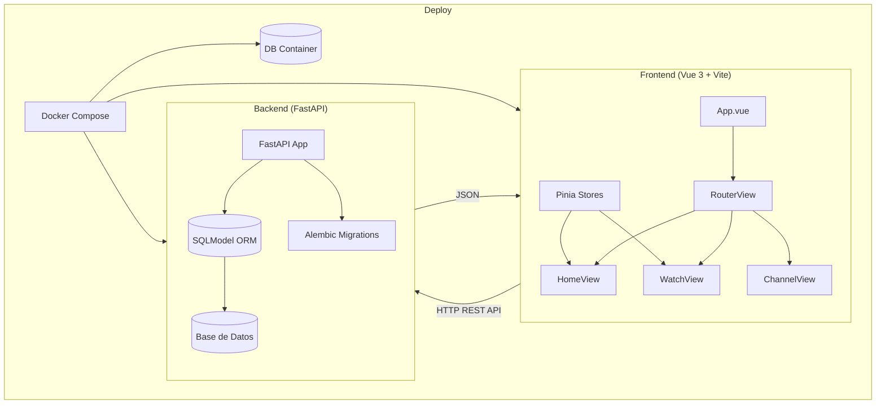

# Clonetube — AGENTS.md

> Análisis completo de la arquitectura, componentes, dependencias y estado actual del proyecto.

---

## 📁 Estructura general del proyecto

```
clonetube/
├── backend/          # API REST con FastAPI (Python 3.14+)
├── frontend/         # SPA con Vue 3 + TypeScript + Vite
├── deploy/           # (vacío) — Reservado para configuraciones de despliegue
└── AGENTS.md         # Este archivo
```

El proyecto **clonetube** es un clon de YouTube en fase inicial (scaffolding). Tiene separación clara entre frontend y backend. La carpeta `deploy/` está vacía y reservada para futuras configuraciones de despliegue (Docker, CI/CD, etc.).

---

## 🔧 Backend (`backend/`)

### Descripción general
API REST construida con **FastAPI** sobre **Python 3.14+**. Usa `uv` como gestor de paquetes. El proyecto está recién inicializado — solo contiene el esqueleto base.

### Archivos

| Archivo | Propósito | Estado |
|---|---|---|
| `main.py` | Punto de entrada de la aplicación. Define `main()` que imprime `"Hello from backend!"`. | Placeholder — sin servidor FastAPI aún |
| `pyproject.toml` | Configuración del proyecto Python y dependencias. | Configuración inicial |
| `README.md` | Documentación del backend. | Vacío |
| `.python-version` | Fija la versión de Python (`>=3.14`). | Configurado |
| `uv.lock` | Lockfile de dependencias generado por `uv`. | Generado |
| `.gitignore` | Exclusiones de git para Python (.venv, etc.). | Configurado |
| `.venv/` | Entorno virtual de Python. | Creado |

### Dependencias (`pyproject.toml`)

| Dependencia | Versión | Propósito |
|---|---|---|
| `fastapi[standard]` | `>=0.139.0` | Framework web asíncrono para la API REST. El extra `[standard]` incluye `uvicorn`, `pydantic`, `python-multipart`, etc. |
| `sqlmodel` | `>=0.0.39` | ORM que combina SQLAlchemy y Pydantic para modelos de base de datos tipados. |
| `alembic` | `>=1.18.5` | Herramienta de migraciones de base de datos para SQLAlchemy. |

### Análisis técnico

- **FastAPI** se eligió por su alto rendimiento asíncrono, validación automática con Pydantic y generación de OpenAPI/Swagger.
- **SQLModel** permite definir modelos que funcionan tanto como tablas SQLAlchemy como esquemas Pydantic, eliminando duplicación.
- **Alembic** manejará migraciones para evolución del esquema de BD.
- `main.py` aún no levanta un servidor — solo imprime un mensaje. Falta implementar la instancia de `FastAPI()` y el punto de entrada `uvicorn`.
- No hay modelos, rutas, ni configuración de base de datos definidos aún.

### Tareas pendientes
- [ ] Crear instancia de `FastAPI` en `main.py` con `uvicorn`.
- [ ] Definir modelos de BD con SQLModel (User, Video, Comment, etc.).
- [ ] Configurar Alembic y crear migración inicial.
- [ ] Implementar endpoints REST (CRUD de videos, autenticación, etc.).
- [ ] Agregar CORS para permitir peticiones desde el frontend.
- [ ] Agregar tests con `pytest` + `httpx`.

---

## 🖥️ Frontend (`frontend/`)

### Descripción general
SPA construida con **Vue 3** (Composition API + `<script setup>`), **TypeScript 6.0**, **Vite 8**, **Pinia** para estado global y **Vue Router 5** para enrutamiento.

### Archivos principales

| Archivo | Propósito | Estado |
|---|---|---|
| `index.html` | HTML de entrada. Monta `#app` y carga `/src/main.ts`. | Configuración base de Vite |
| `package.json` | Dependencias, scripts y metadatos del proyecto. | Completo |
| `vite.config.ts` | Configuración de Vite: plugins (Vue, Vue DevTools) y alias `@` → `./src`. | Configurado |
| `tsconfig.json` | TSConfig raíz que referencia `tsconfig.app.json` y `tsconfig.node.json`. | Configurado |
| `tsconfig.app.json` | TSConfig para el código de la app (extiende `@vue/tsconfig`). Incluye alias `@/*` y `noUncheckedIndexedAccess`. | Configurado |
| `tsconfig.node.json` | TSConfig para archivos de build (vite.config, etc.) usando Node.js. | Configurado |
| `env.d.ts` | Declaración de tipos para el cliente Vite (`/// <reference types="vite/client" />`). | Configurado |
| `README.md` | Documentación oficial del template Vue + Vite. | Template por defecto |

### Estructura de `src/`

```
src/
├── App.vue             # Componente raíz
├── main.ts             # Bootstrap de la aplicación
├── router/
│   └── index.ts        # Configuración de Vue Router
└── stores/
    └── counter.ts      # Store de ejemplo con Pinia
```

### Análisis por archivo fuente

#### `main.ts` — Bootstrap de la aplicación

```typescript
import { createApp } from 'vue'
import { createPinia } from 'pinia'
import App from './App.vue'
import router from './router'

const app = createApp(App)
app.use(createPinia())    // Estado global
app.use(router)           // Enrutamiento
app.mount('#app')         // Montaje en el DOM
```

- Instala **Pinia** antes que el router (buena práctica: el store debe estar disponible para guards de navegación).
- No hay configuración global adicional (plugins, componentes globales, etc.).

#### `App.vue` — Componente raíz

```vue
<script setup lang="ts"></script>
<template>
  <h1>You did it!</h1>
  <p>Visit <a href="...">vuejs.org</a> to read the documentation</p>
</template>
<style scoped></style>
```

- **Estado:** Placeholder del template inicial de Vue.
- Usa `<script setup lang="ts">` (Syntax Sugar de Composition API).
- No tiene layout, `<RouterView />`, ni estilos.
- Falta implementar el layout principal con header, sidebar, y router-view.

#### `router/index.ts` — Enrutamiento

```typescript
import { createRouter, createWebHistory } from 'vue-router'
const router = createRouter({
  history: createWebHistory(import.meta.env.BASE_URL),
  routes: [],  // Sin rutas definidas
})
export default router
```

- Usa `createWebHistory` (modo history de HTML5, sin `#` en la URL).
- **Estado:** Sin rutas definidas. Falta crear vistas como Home, Watch, Channel, etc.
- `import.meta.env.BASE_URL` permite desplegar en subdirectorios.

#### `stores/counter.ts` — Store de ejemplo (Pinia)

```typescript
export const useCounterStore = defineStore('counter', () => {
  const count = ref(0)
  const doubleCount = computed(() => count.value * 2)
  function increment() { count.value++ }
  return { count, doubleCount, increment }
})
```

- Store de ejemplo usando **Setup Store syntax** de Pinia (preferida sobre Options Store).
- Demuestra el patrón: `ref` para estado, `computed` para getters, funciones para acciones.
- **No es parte funcional del proyecto** — debe reemplazarse por stores reales (user, videos, etc.).

### Dependencias

| Dependencia | Versión | Tipo | Propósito |
|---|---|---|---|
| `vue` | `^3.5.38` | runtime | Framework reactivo de UI |
| `vue-router` | `^5.1.0` | runtime | Enrutamiento SPA |
| `pinia` | `^3.0.4` | runtime | Gestión de estado global |
| `vite` | `^8.0.16` | dev | Build tool y dev server |
| `@vitejs/plugin-vue` | `^6.0.7` | dev | Soporte de Vue SFC en Vite |
| `vite-plugin-vue-devtools` | `^8.1.2` | dev | Integración de Vue DevTools en Vite |
| `typescript` | `~6.0.0` | dev | TypeScript |
| `vue-tsc` | `^3.3.5` | dev | Type checking para archivos `.vue` |
| `@vue/tsconfig` | `^0.9.1` | dev | Config base de TS para Vue |
| `@tsconfig/node24` | `^24.0.4` | dev | Config base de TS para Node 24 |
| `@types/node` | `^24.13.2` | dev | Tipos de Node.js |
| `npm-run-all2` | `^9.0.2` | dev | Ejecutar múltiples scripts npm en paralelo/secuencia |

### Scripts

| Script | Comando | Propósito |
|---|---|---|
| `dev` | `vite` | Servidor de desarrollo con HMR |
| `build` | `run-p type-check "build-only {@}" --` | Build de producción: type-check + vite build en paralelo |
| `preview` | `vite preview` | Previsualizar build de producción localmente |
| `build-only` | `vite build` | Solo build sin type-check |
| `type-check` | `vue-tsc --build` | Verificación de tipos con TS |

### Análisis técnico

- **Vite 8** como bundler: HMR instantáneo, build rápido con Rollup.
- **TypeScript 6.0** con `noUncheckedIndexedAccess` activado (accesos a arrays/objetos verificados contra `undefined`).
- Separación limpia de configs TS: app vs node (build tools).
- **Pinia** con Setup Store syntax: mejor inferencia de tipos y composición.
- **Vue DevTools** integrado en desarrollo para debugging.
- El proyecto usa `pnpm` como package manager (según README).

### Tareas pendientes
- [ ] Reemplazar `App.vue` con layout real: header, sidebar, `<RouterView />`.
- [ ] Crear vistas: `HomeView`, `WatchView`, `ChannelView`, `SearchView`, `UploadView`.
- [ ] Definir rutas en `router/index.ts` con lazy loading.
- [ ] Crear stores reales: `useAuthStore`, `useVideoStore`, etc.
- [ ] Agregar componentes UI: `VideoCard`, `CommentSection`, `VideoPlayer`, `Sidebar`.
- [ ] Integrar con API del backend (usando `fetch` o `axios`).
- [ ] Agregar estilos globales (CSS custom properties, reset, tema).

---

## 🚀 Deploy (`deploy/`)

### Estado actual
Carpeta **vacía**. Reservada para futuras configuraciones de despliegue.

### Propósito esperado
- `Dockerfile` para backend y frontend.
- `docker-compose.yml` para orquestación local.
- Configuraciones de CI/CD (GitHub Actions, GitLab CI).
- Scripts de despliegue a VPS o cloud (AWS, Azure, etc.).
- Configuración de reverse proxy (nginx, Caddy).

---

## 🏗️ Arquitectura general planeada



---

## 📊 Resumen de madurez del proyecto

| Capa | Estado | Progreso |
|---|---|---|
| Backend — Framework | Scaffolding inicial | 5% |
| Backend — Modelos BD | No iniciado | 0% |
| Backend — Endpoints API | No iniciado | 0% |
| Frontend — Estructura | Scaffolding inicial | 5% |
| Frontend — Vistas/Rutas | No iniciado | 0% |
| Frontend — Stores | Template de ejemplo | 2% |
| Frontend — Integración API | No iniciado | 0% |
| Deploy | No iniciado | 0% |

---

## 🛠️ Convenciones y guías para agentes

### Backend
- Usar **type hints** de Python en todo el código.
- Los modelos de BD se definen con `SQLModel` (hereda de `SQLAlchemy` y `Pydantic`).
- Las migraciones se gestionan con **Alembic**.
- Seguir estructura modular: `models/`, `routers/`, `schemas/`, `services/`, `core/`.
- Usar `uv` para gestión de dependencias: `uv add <paquete>`, `uv sync`.

### Frontend
- Usar **`<script setup lang="ts">`** en todos los SFC de Vue.
- Stores de Pinia con **Setup Store syntax** (funciones composables).
- Rutas con **lazy loading**: `() => import('@/views/...')`.
- Estilos con **CSS scoped** o **`<style module>`**.
- Alias `@` mapea a `src/`.
- Usar `pnpm` como package manager.

### General
- Commits en español
- PRs pequeños y enfocados en un solo cambio.
- No incluir secretos en el código (usar variables de entorno).

---

*Última actualización: 2026-07-06*
