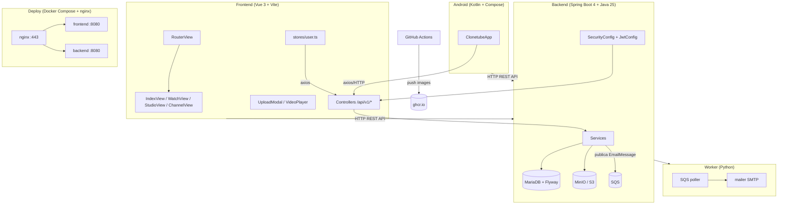

# Clonetube — AGENTS.md

> Analisis completo de la arquitectura, componentes, dependencias y estado actual del proyecto.

---

## Estructura general del proyecto

```
clonetube/
├── .github/
│   └── workflows/
│       ├── ci.yml              # Push a `latest`: tests + build/push imagenes ghcr.io
│       └── ci-tests.yml        # Resto de branches: solo tests (backend + frontend)
├── backend/                    # API REST con Spring Boot 4.0.7 (Java 25, Maven)
│   ├── pom.xml                 # Spring Boot 4.0.7, AWS SDK v2 (BOM), Flyway, springdoc
│   ├── mvnw / mvnw.cmd         # Maven wrapper
│   ├── Dockerfile              # Build maven:eclipse-temurin-25 + runtime temurin JRE
│   ├── src/main/java/me/elordenador/clonetube/
│   │   ├── ClonetubeApplication.java
│   │   ├── controller/         # Auth, Video, User, Points, Health
│   │   ├── service/            # AuthService, VideoService, UserService, PointsService
│   │   ├── repository/         # UserRepository (Spring Data JPA)
│   │   ├── models/             # Entidades JPA: User, Video, MultipartUpload, etc.
│   │   ├── dtos/               # DTOs de request/response
│   │   ├── config/             # SecurityConfig, JwtConfig, SqsConfig
│   │   ├── security/           # UserJwtAuthenticationConverter
│   │   ├── decorators/         # @RequireAuth, @RequireAdmin
│   │   ├── exceptions/         # ResourceNotFoundException
│   │   └── enums/              # VisibilityEnum
│   ├── src/main/resources/
│   │   ├── application.properties
│   │   └── db/migration/V1__initial_version.sql   # Esquema via Flyway
│   └── src/test/               # Tests: H2 en memoria (application-test.properties)
├── backend.old/                # Backend Python/FastAPI LEGACY (no se usa)
├── frontend/                   # SPA con Vue 3 + TypeScript + Vite (pnpm)
│   ├── src/
│   │   ├── App.vue / main.ts / styles.css / types.ts
│   │   ├── router/index.ts     # /, /watch, /studio, /channel/:handle, /dev
│   │   ├── stores/user.ts      # Store real de auth (Pinia)
│   │   ├── composables/        # useTvSignOut.ts
│   │   ├── api/                # channel.ts, feed.ts, social.ts, video.ts
│   │   ├── views/              # IndexView, WatchView, StudioView, ChannelView, DevView
│   │   ├── components/         # Header, VideoPlayer, FollowButton, UploadModal, Tv*
│   │   └── __tests__/          # Vitest + Vue Test Utils + jsdom
│   └── Dockerfile              # Node build multi-stage + Caddy distroless
├── worker/                     # Workers Python: correo SMTP y variantes de vídeo desde SQS/S3
│   ├── main.py                 # Polling SQS + signal handling
│   ├── mailer.py               # Envio via smtplib
│   ├── models.py               # EmailMessage (Pydantic)
│   ├── clients.py              # Cliente SQS (boto3)
│   ├── settings.py             # Pydantic Settings
│   └── Dockerfile
├── android_app/                # App Android (Kotlin + Jetpack Compose)
│   └── app/src/main/java/me/elordenador/clonetube/
│       ├── MainActivity.kt
│       ├── model/Video.kt
│       └── ui/                 # ClonetubeApp, screens (Auth, Channel, Home), components
├── docker-compose.yml          # Stack desarrollo (MariaDB, MinIO, backend, frontend, nginx)
├── deploy/                     # Despliegue en produccion
│   ├── docker-compose.yml      # Stack prod (imagenes ghcr.io + worker)
│   ├── nginx.conf              # Reverse proxy HTTPS con SSL termination
│   └── generate-certs.sh       # Certificados autofirmados
└── AGENTS.md
```

El proyecto **clonetube** es un clon de YouTube: frontend web (Vue 3), API (Spring Boot), app Android (Compose), workers de correo y vídeo (Python/SQS) y despliegue con Docker Compose + nginx HTTPS. `backend.old/` es el backend Python legado, sin uso.

---

## Backend (`backend/`)

### Descripcion general

API REST con **Spring Boot 4.0.7** sobre **Java 25**, gestionada con **Maven**. Persistencia con **Spring Data JPA + Flyway** sobre MariaDB/MySQL. Seguridad JWT con Spring Security OAuth2 Resource Server (HS256). Almacenamiento de videos en **S3** (MinIO local o AWS) con multipart upload. Documentacion OpenAPI con springdoc (`/docs`, `/openapi.json`).

### Archivos principales

| Archivo / paquete | Proposito |
|---|---|
| `ClonetubeApplication.java` | Punto de entrada Spring Boot |
| `controller/` | 5 REST controllers (ver endpoints) |
| `service/` | Logica de negocio: `AuthService`, `VideoService`, `UserService`, `PointsService` |
| `repository/UserRepository.java` | Spring Data JPA; incluye `findByUsername`, `findByEmail`, `findByVerifyCode` |
| `models/` | Entidades JPA: `User`, `Video`, `UserFollowsUser`, `UserLikesVideo`, `UserCanViewVideo`, `MultipartUpload`, `PointsHistory`, `EmailMessage` |
| `dtos/` | DTOs de request/response (auth, multipart, feed, canal, studio, puntos) |
| `config/SecurityConfig.java` | CSRF off, stateless, `/api/v1/auth/**` permitAll, resto denyAll + JWT resource server, `@EnableMethodSecurity` |
| `config/JwtConfig.java` | `JwtDecoder`/`JwtEncoder` HS256 a partir de `security.jwt.secret` |
| `config/SqsConfig.java` | Bean `SqsClient` con `aws.sqs.region` |
| `security/UserJwtAuthenticationConverter.java` | Convierte el JWT en `Authentication` |
| `decorators/` | `@RequireAuth`, `@RequireAdmin` (anotaciones custom) |
| `db/migration/V1__initial_version.sql` | Esquema completo gestionado por Flyway |

### Dependencias (`pom.xml`)

| Dependencia | Version | Proposito |
|---|---|---|
| `spring-boot-starter-parent` | 4.0.7 | Parent de Spring Boot |
| `spring-boot-starter-data-jpa` | — | ORM / repositorios |
| `spring-boot-starter-flyway` | — | Migraciones de BD |
| `spring-boot-starter-security` | — | Seguridad |
| `spring-boot-starter-oauth2-resource-server` | — | Validacion de JWT |
| `spring-boot-starter-webmvc` | — | Web MVC |
| `spring-boot-starter-jackson` | — | Serializacion JSON |
| `springdoc-openapi-starter-webmvc-ui` | 3.0.2 | Swagger UI (`/docs`) |
| `mysql-connector-j` / `mariadb-java-client` | — | Drivers JDBC (runtime) |
| `lombok` | — | Boilerplate (optional) |
| `software.amazon.awssdk:s3` / `sqs` | 2.46.21 (BOM) | Clientes S3 y SQS |
| `spring-boot-starter-test` + `webmvc-test` | — | Tests (scope test) |
| `h2` | — | BD en memoria para tests (scope test) |

### Configuracion (`application.properties`)

| Variable de entorno | Propiedad Spring |
|---|---|
| `SPRING_DATASOURCE_URL` | `spring.datasource.url` |
| `SPRING_DATASOURCE_USERNAME` | `spring.datasource.username` |
| `SPRING_DATASOURCE_PASSWORD` | `spring.datasource.password` |
| `JWT_SECRET` | `security.jwt.secret` |
| `AWS_REGION` | `aws.sqs.region` |
| `SQS_QUEUE_URL` | `aws.sqs.queue-url` |
| `VIDEO_TRANSCODE_QUEUE_URL` | `aws.sqs.video-queue-url` |
| `AWS_BUCKET_NAME` | `aws.s3.bucket` |
| `S3_ENDPOINT_URL` | `aws.s3.endpoint` |
| `S3_PUBLIC_ENDPOINT_URL` (opcional) | `aws.s3.public-endpoint`, base pública/CDN para leer vídeos públicos |
| `DOMAIN` | `domain` |

`spring.jpa.hibernate.ddl-auto=validate` (el esquema lo gestiona Flyway, `V1__initial_version.sql`).

### API — Endpoints implementados

**Auth** (`/api/v1/auth`, prefix `POST`/`GET`):

| Metodo | Ruta | Proposito |
|---|---|---|
| `POST` | `/register` | Registro (devuelve `status: pending_confirmation` + codigo) |
| `POST` | `/login` | Login, devuelve token JWT |
| `POST` | `/change-password` | Cambio de contrasena (auth) |
| `POST` | `/forgot-password` | Solicita reset, genera token |
| `POST` | `/reset-password` | Restablece contrasena con token |
| `GET` | `/me` | Datos del usuario autenticado |
| `GET` | `/test_mail` | Endpoint de prueba de envio de email |
| `GET` | `/verify/{code}` | Verificacion de email por codigo |

**Video** (`/api/v1/video`, todos `@RequireAuth` salvo stream/detail):

| Metodo | Ruta | Proposito |
|---|---|---|
| `POST` | `/start-multipart` | Inicia multipart upload en S3, genera key UUID |
| `GET` | `/sign-chunk` | URL prefirmada (1h) para subir un fragmento directo a S3 |
| `PUT` | `/upload-chunk` | Recibe el fragmento y lo reenvia a S3 (camino del frontend) |
| `POST` | `/complete-multipart` | Completa el multipart upload |
| `DELETE` | `/cancel-multipart` | Aborta un multipart upload |
| `GET` | `/list` | Lista videos en S3 con metadatos |
| `GET` | `/catalog` | Catalogo de videos |
| `GET` | `/feed` | Feed personalizado (`limit`, `only_following`) |
| `GET` | `/detail` | Detalle de video |
| `GET` | `/studio` | Listado del estudio del autor |
| `PATCH` | `/{video_id}` | Actualiza video (nombre, descripcion, visibilidad...) |
| `DELETE` | `/{video_id}` | Elimina video |
| `GET` | `/stream-url` | URL de reproduccion (`/api/v1/video/stream`) |
| `GET` | `/stream` | Sirve el video desde S3 con soporte `Range` |

**Users** (`/api/v1/users`):

| Metodo | Ruta | Proposito |
|---|---|---|
| `GET` | `/me/following` | Usuarios seguidos por el autenticado |
| `GET` | `/{username}/channel` | Ficha del canal |
| `GET` | `/{username}/videos` | Videos del canal paginados (`page`, `page_size`) |
| `GET` | `/{username}/follow` | Estado de seguimiento |
| `POST` | `/{username}/follow` | Seguir (idempotente) |
| `DELETE` | `/{username}/follow` | Dejar de seguir (idempotente) |

**Otros**: `GET /api/v1/points` (puntos del usuario) y `GET /api/v1/health`.

### Base de datos (Flyway `V1__initial_version.sql`)

Tablas: `user` (username, password_hash, password_version, verify_code, points, is_admin...), `user_follows_user`, `video` (filename, author, visibility...), `user_can_view_video`, `multipart_upload` (upload_id, upload_key, owner_id, status), `user_likes_video`, `points_history`.

### Tests

- `src/test/resources/application-test.properties`: H2 en memoria, Flyway desactivado, JWT de test.
- `ClonetubeApplicationTests`: carga el contexto.
- `AuthControllerTest`: `@WebMvcTest` con mocks (Spring Boot 4), cubre register/login con el contrato actual (`pending_confirmation`).
- `EmailMessageTest`: modelo Pydantic del worker (portado).
- Ejecutar: `mvn -B test` en `backend/` (funciona sin BD externa).

### Dockerfile

1. **build**: `maven:3.9-eclipse-temurin-25`, `dependency:go-offline` + `package -DskipTests`.
2. **runtime**: `eclipse-temurin:25-jre-alpine`, usuario `app` no root, `EXPOSE 8080`, `java -jar app.jar`.

---

## Frontend (`frontend/`)

### Descripcion general

SPA con **Vue 3** (Composition API + `<script setup lang="ts">`), **TypeScript**, **Vite 8**, **Pinia** y **Vue Router 5**. Tema oscuro. Tests con **Vitest + Vue Test Utils + jsdom**. Cliente HTTP con **axios**.

### Estructura de `src/`

```
src/
├── App.vue                  # <RouterView /> + reset CSS + tema oscuro
├── main.ts                  # Bootstrap: Pinia + Router
├── styles.css               # Estilos globales
├── types.ts                 # Tipos compartidos (User, Token, Video...)
├── router/index.ts          # Rutas con lazy loading
├── stores/user.ts           # Auth store (login, register, logout, token persistido)
├── composables/useTvSignOut.ts
├── api/                     # axios clients: channel, feed, social, video
├── views/
│   ├── IndexView.vue        # Home / feed
│   ├── WatchView.vue        # Reproductor de video
│   ├── StudioView.vue       # Estudio del autor
│   ├── ChannelView.vue      # Pagina de canal (/channel/@usuario)
│   └── DevView.vue          # Sandbox de multipart upload
└── components/
    ├── Header.vue           # Header de la app
    ├── VideoPlayer.vue      # Reproductor (stream por /api/v1/video/stream)
    ├── FollowButton.vue     # Boton de suscripcion
    ├── UploadModal.vue      # Modal de subida multipart por fragmentos
    ├── TvModalShell.vue     # Shell de modales estilo TV
    └── TvSignOutOverlay.vue # Overlay de cierre de sesion
```

### Paginas

- **Home** (`/`): feed de videos (`api/feed.ts`).
- **Watch** (`/watch`): reproduccion con `VideoPlayer` + stream con `Range` (`api/video.ts`).
- **Studio** (`/studio`): gestion de videos del autor (`/api/v1/video/studio`).
- **Channel** (`/channel/@usuario`): ficha de canal + rejilla paginada de videos (`api/channel.ts`); si la URL llega sin arroba se reescribe.
- **Dev** (`/dev`): sandbox de multipart upload con `UploadModal` (chunks de 5 MB via `PUT /upload-chunk`).

### Dependencias

| Dependencia | Version | Tipo | Proposito |
|---|---|---|---|
| `vue` | ^3.5.38 | runtime | UI |
| `vue-router` | ^5.1.0 | runtime | Enrutamiento SPA |
| `pinia` | ^3.0.4 | runtime | Estado global |
| `axios` | ^1.18.1 | runtime | Cliente HTTP |
| `vite` | ^8.0.16 | dev | Build tool |
| `typescript` | ~6.0.0 | dev | Tipos |
| `vue-tsc` | ^3.3.5 | dev | Type checking |
| `vitest` | ^4.1.10 | dev | Tests |
| `@vue/test-utils` + `jsdom` | — | dev | Testing de componentes |
| `npm-run-all2` | ^9.0.2 | dev | Scripts en paralelo |

### Scripts

| Script | Comando | Proposito |
|---|---|---|
| `dev` | `vite` | Dev server con HMR |
| `build` | `run-p type-check "build-only {@}" --` | Type-check + build |
| `type-check` | `vue-tsc --build` | Verificacion de tipos |
| `test` | `vitest run` | Tests |

### Dockerfile

Build multi-stage: **node:24-slim + pnpm** compila y descarga Caddy v2.9.1 estatico; runtime **gcr.io/distroless/static-debian12:nonroot** con `dist/`, Caddy escucha en 8080, proxy `/api/` a `backend:8080` y SPA fallback a `index.html`.

---

## Worker (`worker/`)

La misma imagen Python ejecuta dos consumidores independientes sobre colas SQS separadas:

- `main.py`: consume mensajes de correo y los envia por SMTP.
- `video_worker.py`: descarga originales de S3, valida con ffprobe y genera variantes MP4 H.264/AAC de 1080p, 720p, 480p, 360p y 120p.

El worker de vídeo admite como fuente máxima 4K a 30 fps, 1080p/720p a 60 fps y resoluciones inferiores a 30 fps. Está preparado para ejecutarse en EC2 mediante instance profile, sin credenciales AWS estáticas.

- `main.py`: loop de polling con `visibility_timeout`/`wait_time_seconds` (20s long-polling), manejo de señales (SIGTERM/SIGINT) para parada limpia, borrado de mensajes tras enviar.
- `mailer.py`: `send_email` por SMTP con SSL.
- `models.py`: `EmailMessage` (Pydantic) — el payload que publica el backend en SQS.
- `settings.py`: `queue_url`, `aws_region`, `smtp_*`, `visibility_timeout`, `wait_time_seconds`.
- Dockerfile propio; imagen `ghcr.io/dsaub/clonetube-worker`.

---

## Android (`android_app/`)

App Android en **Kotlin + Jetpack Compose** (Gradle).

- `MainActivity.kt` + `ui/ClonetubeApp.kt`: navegacion Compose.
- `ui/screens/`: `AuthScreen`, `ChannelScreen`, `HomeTab`, etc.
- `ui/components/`: `VideoRow`, `Common`, `Icons`.
- `model/Video.kt`: modelo de video.
- Habla con la misma API `/api/v1`.

---

## Deploy (`deploy/`)

### docker-compose.yml (raiz, desarrollo)

Stack local: `mariadb:11`, `minio` (+ `minio-init` que crea el bucket), `backend` (build local), `frontend` (build local), `nginx` con `deploy/nginx.conf` y certs.

### deploy/docker-compose.yml (produccion)

Imagenes ghcr.io pre-built: `backend`, `frontend`, `nginx` y `worker`. MariaDB/MinIO se asumen externos (no estan en el stack).

### nginx.conf

- Puerto 80 → redirect 301 a HTTPS; 443 → SSL termination (certs en `/etc/nginx/certs/`).
- `client_max_body_size 10G`.
- `/api/` → `backend:8080` con `proxy_request_buffering off` y `proxy_buffering off` (necesario para streaming/subida de fragmentos), timeouts de 300s.
- `/docs` y `/openapi.json` → `backend:8080` (Swagger).
- Assets estaticos con cache 1y, resto → `frontend:8080` (SPA fallback).

### generate-certs.sh

Genera certificados autofirmados (RSA 2048, 365 dias, SAN `localhost` + `127.0.0.1`); no sobrescribe existentes.

### Variables de entorno

| Variable | Default (dev) | Proposito |
|---|---|---|
| `MARIADB_ROOT_PASSWORD` / `MARIADB_DATABASE` / `MARIADB_USER` / `MARIADB_PASSWORD` | rootpassword / clonetube / clonetube / password | MariaDB |
| `MINIO_ROOT_USER` / `MINIO_ROOT_PASSWORD` | minioadmin | MinIO |
| `AWS_ACCESS_KEY_ID` / `AWS_SECRET_ACCESS_KEY` | minioadmin | Credenciales S3 |
| `AWS_REGION` | us-east-1 (prod: eu-west-3) | Region |
| `AWS_BUCKET_NAME` | clonetube | Bucket S3 |
| `S3_ENDPOINT_URL` | http://minio:9000 | Endpoint S3 |
| `S3_PUBLIC_ENDPOINT_URL` | vacio (prod: URL de CloudFront) | Base pública/CDN para leer vídeos públicos |
| `SPRING_DATASOURCE_URL` / `SPRING_DATASOURCE_USERNAME` / `SPRING_DATASOURCE_PASSWORD` | jdbc:mariadb://mariadb:3306/clonetube / clonetube / password | Conexion BD del backend |
| `JWT_SECRET` | cambiar-por-clave-segura... | Firma JWT |
| `SQS_QUEUE_URL` | (vacio) | Cola SQS del worker |
| `VIDEO_TRANSCODE_QUEUE_URL` | (vacio) | Cola SQS dedicada a trabajos de vídeo |
| `DOMAIN` | http://localhost | Dominio publico |
| `SMTP_HOST` / `SMTP_PORT` / `SMTP_USERNAME` / `SMTP_PASSWORD` / `SMTP_FROM` | — | SMTP del worker (prod) |
| `QUEUE_URL` | — | Cola del worker (prod) |

---

## CI/CD (`.github/workflows/`)

### ci.yml — push a `latest`

1. **backend-tests**: setup-java (temurin 25, cache maven) + `mvn -B test` en `backend/`.
2. **frontend-tests**: pnpm + Node 24 + `vitest run` en `frontend/`.
3. **build** (needs tests): matrix `[backend, frontend, worker]`, buildx multi-plataforma (`linux/amd64,linux/arm64`), push a `ghcr.io/dsaub/clonetube-<service>` con tags `latest` y `${{ github.sha }}`, cache gha por scope.

### ci-tests.yml — resto de branches

Igual que los pasos de tests de ci.yml (backend + frontend), sin build/push.

Los reportes de tests se publican con `dorny/test-reporter` (surefire XML / JUnit XML de vitest).

---

## Arquitectura general



---

## Resumen de madurez del proyecto

| Capa | Estado | Progreso |
|---|---|---|
| Backend — API REST | Spring Boot 4.0.7, 5 controllers, ~30 endpoints | 70% |
| Backend — Auth | JWT HS256, register/login/me, change/reset password, verify code, admin | 60% |
| Backend — Multipart Upload | start/sign/upload/complete/cancel + stream con Range | 80% |
| Backend — BD | JPA + Flyway (V1) sobre MariaDB | 60% |
| Backend — Tests | H2 + WebMvcTest (auth, email model, context) | 30% |
| Frontend — Vistas | Index, Watch, Studio, Channel, Dev | 60% |
| Frontend — Auth store | `stores/user.ts` + api modules axios | 50% |
| Frontend — Tests | Vitest + Test Utils (api specs, App) | 30% |
| Worker — Email | SQS poller + SMTP, Dockerfile | 80% |
| Android — App | Compose: Auth, Home, Channel screens | 30% |
| Deploy — Docker | Compose dev + prod, nginx HTTPS, worker | 90% |
| CI/CD | Tests (Maven/Vitest) + build/push multi-arch ghcr.io | 85% |

---

## Convenciones y guias para agentes

### Backend (Spring Boot)
- Java 25, Maven (`mvn` / `./mvnw`), Spring Boot 4.0.7.
- Tests: `mvn -B test` en `backend/` (H2, sin BD externa).
- Esquema gestionado por **Flyway** (`spring.jpa.hibernate.ddl-auto=validate`, nunca `update` en prod).
- Seguridad: JWT HS256 via `spring-boot-starter-oauth2-resource-server`; anotaciones `@RequireAuth` / `@RequireAdmin`.
- S3 y SQS con AWS SDK v2 (BOM en `dependencyManagement`).
- DTOs en `dtos/`, entidades en `models/`, logica en `service/`, HTTP en `controller/`.

### Frontend (Vue)
- `<script setup lang="ts">` en todos los SFC; estilos scoped.
- Pinia Setup Store; rutas con lazy loading; alias `@` → `src/`.
- Cliente HTTP con axios (`src/api/`).
- Tests: `pnpm vitest run` en `frontend/`.
- Tema oscuro (`#0f0f1a` fondo, `#e0e0e0` texto, `#6c63ff` accent, `#2a2a4a` bordes).

### General
- Commits en espanol; PRs pequenos y enfocados.
- No incluir secretos en el codigo (variables de entorno).
- Imagenes Docker en `ghcr.io/dsaub/clonetube-<service>` (backend, frontend, worker).
- `backend.old/` es legado: no modificar, no usar.

---

*Ultima actualizacion: 2026-08-05*
